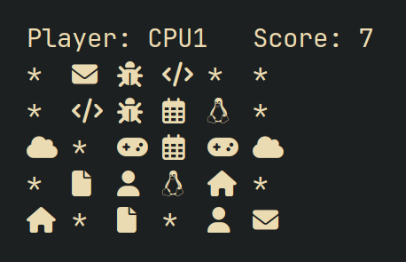

# PairSearchGame

This python game, created for a class project, involves finding pairs of matching symbols. You can compete against another player or against the computer (CPU). If the symbols match, they stay face-up; otherwise, they flip back. The game ends when you find (((rows * columns) / 2) / 2) pairs. It’s a fun game to practice memory skills and enjoy with friends.

All the documentation and project was made by me.




# Installation (Linux Only) 
[WIP NOT READY YET]


```shell
```

## Uninstall
```shell
```

# Use
```shell
$ pairSearchGame
```